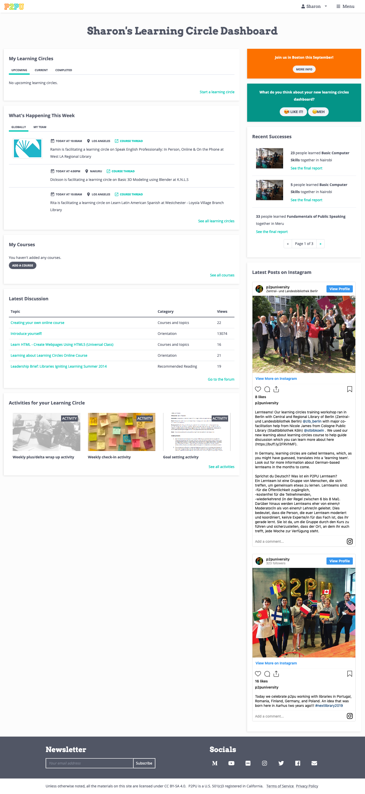

Facilitator Dashboard Guide
===========================

The facilitator dashboard was created to help people run effective learning meetings. You'll find tools that help you create and promote learning circles; a messaging system that you can use to communicate with participants; a feedback tool for sharing information with your colleagues and P2PU; and a report feature that collects and aggregates feedback from learning circle participants.

Log In
------
To access your dashboard you'll first need to create a P2PU account, which you can do from the P2PU homepage.

.. image:: _static/2018-12-12-account-creation.png

After setting your password you will be logged in and redirected to your dashboard. You can also access your dashboard directly at https://learningcircles.p2pu.org/en/.

What’s on your Dashboard
------------------------

My Learning Circles
^^^^^^^^^^^^^^^^^^^
The first table on your Dashboard shows the learning circles of which you are the facilitator. You have three tabs that list your upcoming, current, and completed learning circles. If you don’t have any yet, click on “Start a learning circle” to create one.

My Team's Learning Circles
^^^^^^^^^^^^^^^^^^^^^^^^^^
You only have this table if you are part of a team. It shows all of the learning circles facilitated by members of your team.

If you are part of a larger organization that is running learning circles (such as Chicago Public Library), you should contact your learning circle organizer to make sure that you are added to the team. This will ensure that information about your learning circles is shared with them and that you have access to this section on your Dashboard.

My Courses
^^^^^^^^^^
As a facilitator, you can add online courses to the P2PU platform to use in a learning circle. This table shows the courses that you have added, along with a link to go to the course editing page for each one. If you haven’t added any courses yet, you’ll have the option to “Add a course”.

My Events
^^^^^^^^^
P2PU has a community events calendar that facilitators can add relevant events to. If you haven’t added any events, you can do so in this section. If you have created any events, you will be able to view and edit them in this table.

Notifications and Announcements
^^^^^^^^^^^^^^^^^^^^^^^^^^^^^^^
If there are any actions that you need to take, such as validating your email address, a personalized notification will appear at the top of your dashboard. On the top right, you will see any announcements directed at all facilitators.

Additional Dashboard Features
^^^^^^^^^^^^^^^^^^^^^^^^^^^^^
**What’s Happening this Week:** By default, this section shows up to three upcoming meetings taking place globally. On the “My Team” tab, if you are on a team you will see the upcoming meetings for learning circles facilitated by your team members.

**Latest Discussion:** This section shows the five most recently commented topics from the community forum, along with a direct link to the forum home page.

**Featured Resources:** The top resources that we think are crucial for facilitators to have easy access to on their Dashboard.

**Recent Successes:** This is where we highlight recently completed learning circles with a link to the learning circle’s final report based on learner and facilitator feedback.

**Latest Posts on Instagram:** P2PU is on Instagram. This section shows our two most recent posts. You can also click through to our account.

Support
-------

If you have any questions, encounter any problems or need to do something that is not addressed above, you can contact us on our `forum <https://community.p2pu.org>`_.

