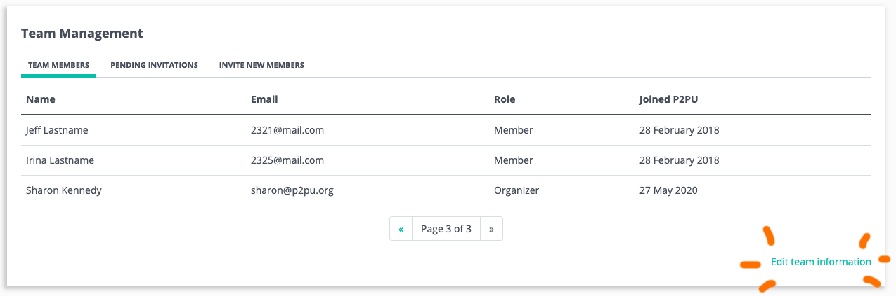
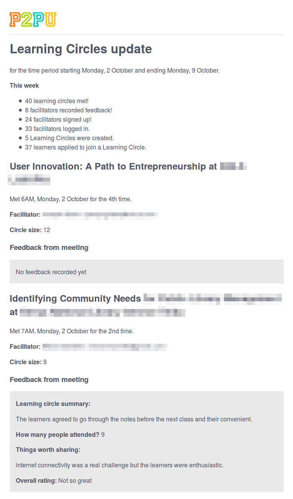
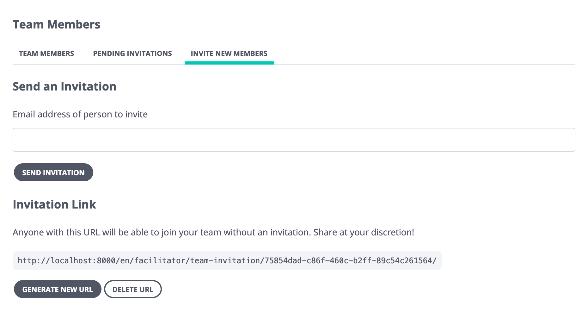
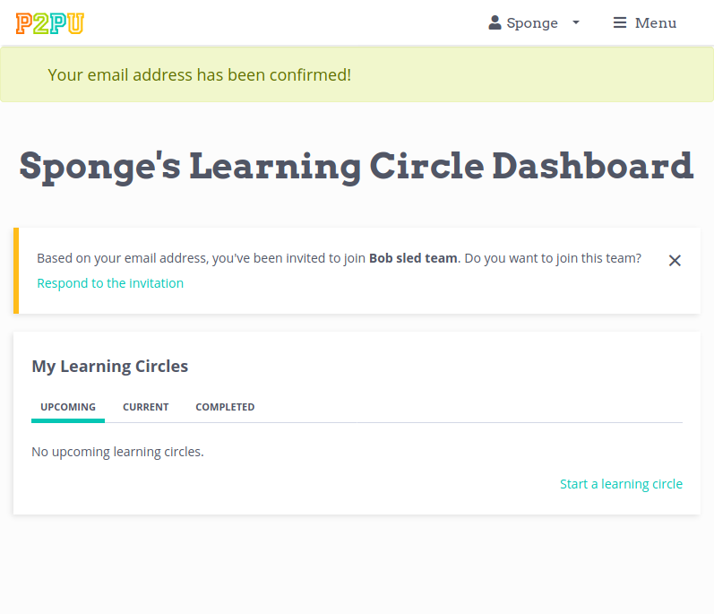

Team Organizer Guide
====================

We offer additional functionality for institutions that are running learning circles across multiple locations ("teams"). Each team is led by an organizer, who works closely with P2PU to ensure that new facilitators in their area have everything they need to run learning circles. Teams are granted the following features and functionality:

+ A customizable learning circle team website
+ Aggregated team activity on the dashboard
+ A weekly email with team updates
+ Aggregated learning circle feedback and data
+ Team profile featured on the P2PU stite

Current learning circle teams are visible at https://www.p2pu.org/en/teams/

If you would like to start a new team, please contact thepeople@p2pu.org

Team Dashboards
---------------
All team members (both organizers and facilitators) will see a new block on their dashboard that highlights upcoming learning circles across the team. Organizers will see an additional block called Team Management. This table includes a list of current team members, pending team invitations, and a tab where organizers can invite new team members.

Team Sites
----------
Each team has a unique learning circle landing page, which features all learning circles happening across your team. By default, the URL will be set to p2pu.org/[your team name]. The top of the page features information unique to your team, including a custom image, logo, introductory text, and customizable links for a dedicated website and contact email. 

Organizers can edit this information directly from their dashboard by clicking 'edit team information':

Changes that organizers make through this form should update almost immediately. 

Certain changes, like the editing the team name and URL, need to be handled by P2PU directly. Additionally, adding and removing team members will not be immediately reflected on the team site but will be updated when P2PU next pushes changes to the website (generally at least once a week). You can send an email to support@p2pu.org if you need these updates visible sooner.

Team Profiles
-------------
Your team page has a carousel with all of the profiles of the facilitators on your team. Any facilitators who haven’t filled out their profile will appear with their name and a placeholder image like this:

Additionally, organizer profiles will also be featured on P2PU's team directory (https://www.p2pu.org/en/teams/).

Profiles can be updated from P2PU account settings (https://learningcircles.p2pu.org/en/accounts/settings/). Organizers should encourage faciltiators to add an image so that they can be fully featured on the team page!

Weekly Email Update
-------------------
Team organizers receive a weekly update every Monday. This update contais information about past, present, and upcoming meetings on your team, including learning circle reports, weekly feedback from facilitators, and information about who is signing up. Facilitators can also opt into receiving this weekly update through their account settings.

Managing Team Membership
-------------------
There are three ways an organizer can add members to their team, each of which can be found on the "Invite New Members" tab of the Team Management block. Currently team members can only be removed by contacting the P2PU team.

Option 1: Email invitation
^^^^^^^^^^^^^^^^^^^^^^^^^^
You can send invitations directly via email. If the recipient already has a P2PU account, they will be prompted to join your team. If they do not, they will first be prompted to create a P2PU account.

Option 2: Automatically through email domain
^^^^^^^^^^^^^^^^^^^^^^^^^^^^^^^^^^^^^^^^^^^^
If your team is associated with an organization that has its own email domain, we can save the email domain in your team settings so that any new facilitator with a validated matching email address will automatically receive an invitation to join your team. For example, if your team members all have staff emails such as *sharon@bigpubliclibrary.org*, you can set *bigpubliclibrary.org* as your team domain so that when someone with an email address like *nico@bigpubliclibrary.org* registers on the P2PU platform, they’ll get invited to join the team. If you want to use this method, please contact us directly to set the email domain.

Option 3: Invitation link
^^^^^^^^^^^^^^^^^^^^^^^^^
As an organizer, you can generate a unique link that allows anyone with the link to join your team. You can regenerate this link whenever you want, making any previous links inactive, or you can disable the invitation link altogether.

