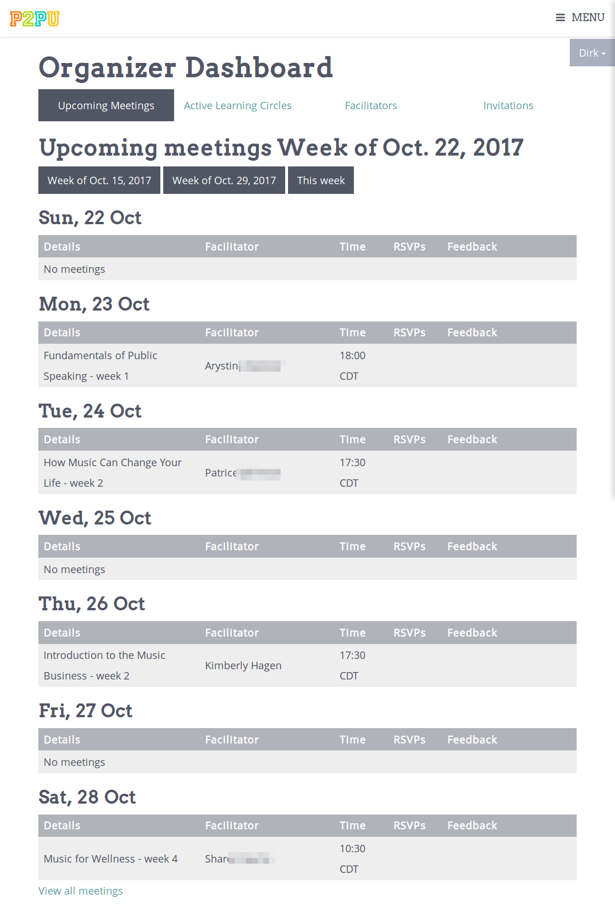
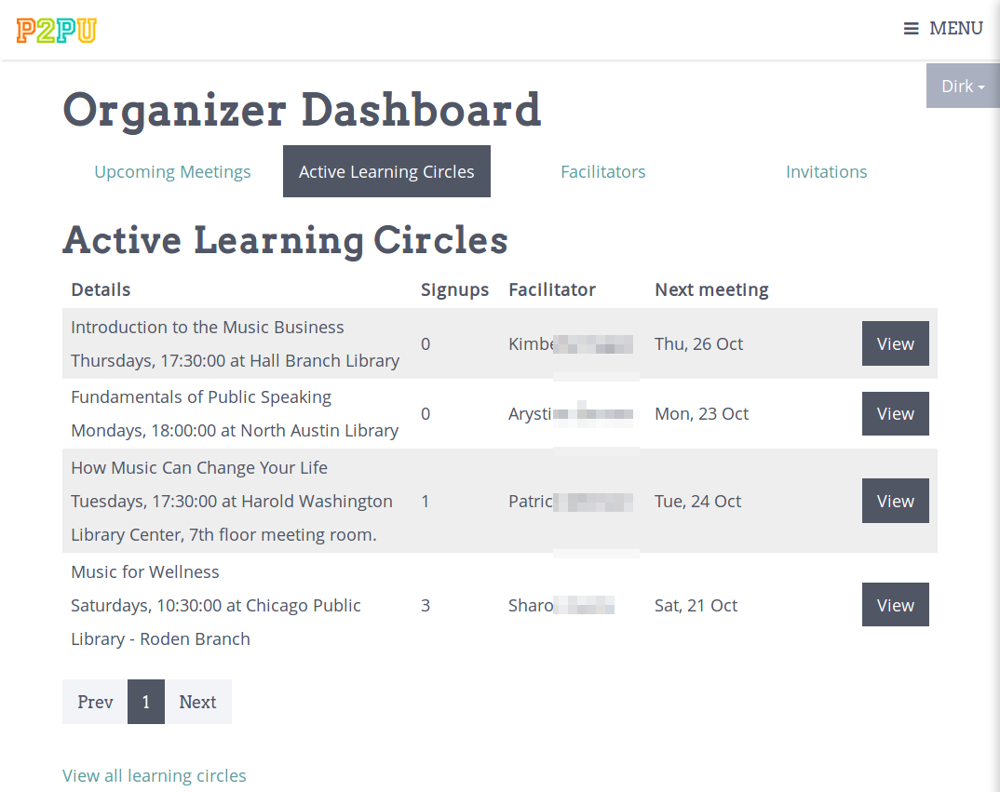
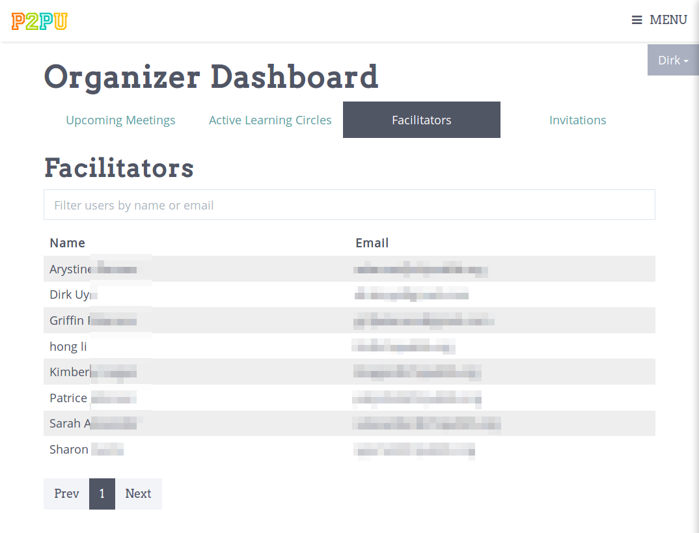
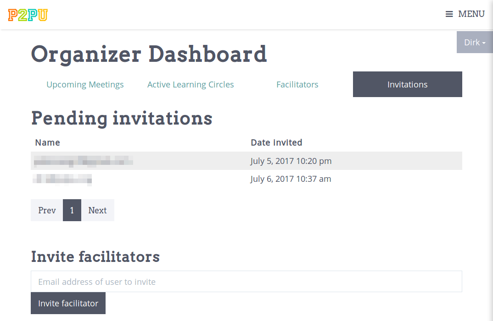
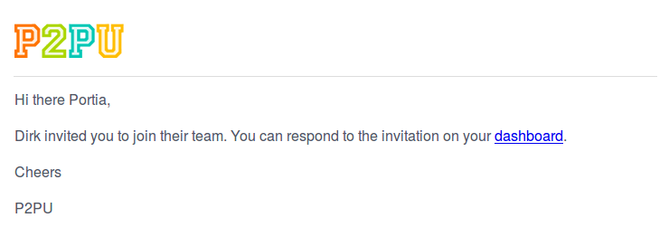
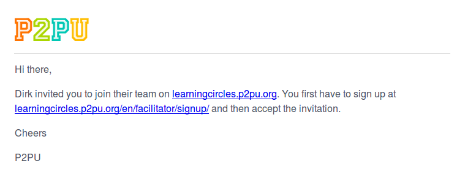
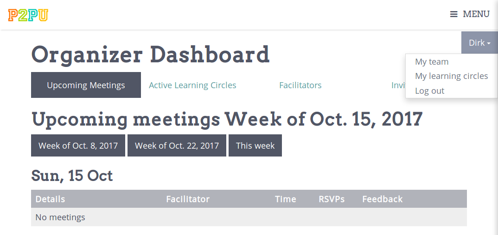

Team organizer guide
====================

For cities and institutions that are running multiple leanring circles, we offer team organizer functionality. As a team organizer, you get an overview of what is going on in learning circles run by facilitators across your team. Organizers are often facilitators, but this does not have to be the case. 

Teams have to be manually added by P2PU. So if you aren't sure if you have one or have trouble accessing it, contact the P2PU team.

To get started, log into your dashboard - https://learningcircles.p2pu.org/en/accounts/login/

Dashboard overview
------------------

At the top of your dashboard, there are 4 different tabs for organizsers to switch between: upcoming meetings, active learning circles, facilitators and invitations.

The **upcoming meetings** view gives you an overview of what learning circles are meeting this week. You can also see what is happening the previous week or the next week.

The **active learning circles** view gives you a list of all the learning circles that still have meetings scheduled in the future.

The **facilitators** view gives you a list of all the facilitators that are currently part of your team.

The **invitations** view shows you a list of everyone who was invited to join your team, this is also where you will invite new facilitators.

Adding facilitators
-------------------

To inviate a facilitator to join your team, you should go to the **invitations** tab mentioned above. Once here, you should enter the email address for the facilitatoryou want to invite below the list of current invitations.

If you invite a facilitator that is already signed up to learning circles, they will receive a notification asking them to confirm that they wish to join your team.

If they haven't already signed up, they will receive a message asking them to sign up.

Once the facilitator signed up, they will need to accept the team invitation on their learning circles facilitator dashboard.

Weekly update
-------------

As a team organizer you will also receive a weekly update every Monday. This update with contain information about past, present, and upcoming meetings on your team, including learning circle reports, weekly feedback from facilitators, and information about who is signing up.

.. image:: _static/organizer-weekly-update.png

Facilitator dashboard
---------------------

You can still access your facilitator dashboard to create and run learning circles yourself. Use the dropdown menu in the top right with your name on it to switch between your team dashboard and your facilitator dashboard.

